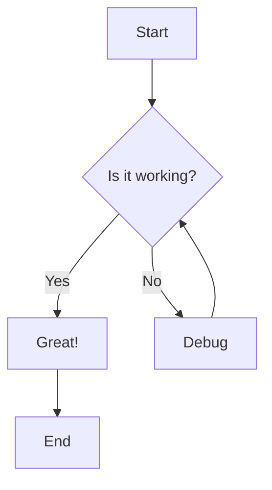

# Mermaid.js Integration

This project now supports rendering Mermaid diagrams in markdown code blocks. Mermaid is a JavaScript-based diagramming and charting tool that renders text-based descriptions to create and modify diagrams dynamically.

## Features

- ✅ Renders mermaid code blocks as interactive diagrams
- ✅ Supports all mermaid diagram types (flowcharts, sequence diagrams, class diagrams, etc.)
- ✅ Maintains syntax highlighting for regular code blocks
- ✅ Responsive design that works on all screen sizes
- ✅ Dark mode support
- ✅ Error handling with fallback display

## Usage

### In Chat Messages

Simply include a mermaid code block in your messages:

````markdown
Here's a flowchart:


````

### Supported Diagram Types

1. **Flowcharts**
   ```mermaid
   graph TD
       A[Start] --> B[Process]
       B --> C[End]
   ```

2. **Sequence Diagrams**
   ```mermaid
   sequenceDiagram
       participant User
       participant App
       User->>App: Request
       App-->>User: Response
   ```

3. **Class Diagrams**
   ```mermaid
   classDiagram
       class Animal {
           +name: string
           +makeSound()
       }
       class Dog {
           +bark()
       }
       Animal <|-- Dog
   ```

4. **Gantt Charts**
   ```mermaid
   gantt
       title Project Timeline
       section Phase 1
       Task 1 :done, task1, 2024-01-01, 2024-01-10
       Task 2 :active, task2, 2024-01-11, 2024-01-20
   ```

5. **Pie Charts**
   ```mermaid
   pie title Sales Distribution
       "Product A" : 30
       "Product B" : 25
       "Product C" : 45
   ```

## Implementation Details

### Components

1. **MermaidDiagram.tsx** - Core component that renders individual mermaid diagrams
2. **MarkdownRenderer.tsx** - Custom markdown renderer that detects and handles mermaid code blocks
3. **MessageItem.tsx** - Updated to use the new MarkdownRenderer

### How It Works

1. The `MarkdownRenderer` component uses a custom renderer for the `marked` library
2. When it encounters a code block with language `mermaid`, it creates a placeholder div
3. The placeholder contains the mermaid code as a data attribute
4. After the markdown is parsed, the component finds all mermaid placeholders
5. For each placeholder, it creates a `MermaidDiagram` component and renders it
6. The `MermaidDiagram` component uses the mermaid library to render the SVG diagram

### Error Handling

If a mermaid diagram fails to render, it will display:
- An error message explaining what went wrong
- The original mermaid code for debugging
- A collapsible section to show/hide the code

### Styling

The mermaid diagrams are styled with:
- Light background with border in light mode
- Dark background with border in dark mode
- Centered layout with responsive sizing
- Proper spacing and margins

## Testing

You can test the mermaid integration by:

1. Starting a chat with any model
2. Sending a message containing mermaid code blocks
3. The assistant should render the diagrams properly

Example test message:
```
Please create a flowchart showing the user authentication process.
```

## Dependencies

- `mermaid` - Core mermaid library
- `@types/mermaid` - TypeScript definitions
- `marked` - Markdown parsing (already in use)
- `prismjs` - Syntax highlighting (already in use)

## Configuration

The mermaid library is initialized with these settings:
- `startOnLoad: false` - Manual rendering control
- `theme: 'default'` - Default theme
- `securityLevel: 'loose'` - Allow external content
- `fontFamily: 'monospace'` - Consistent font

You can modify these settings in `MermaidDiagram.tsx` if needed. 